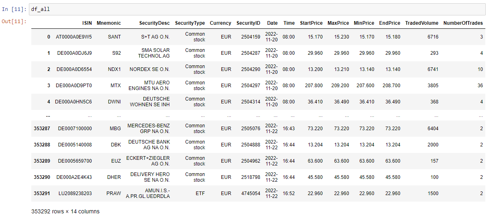
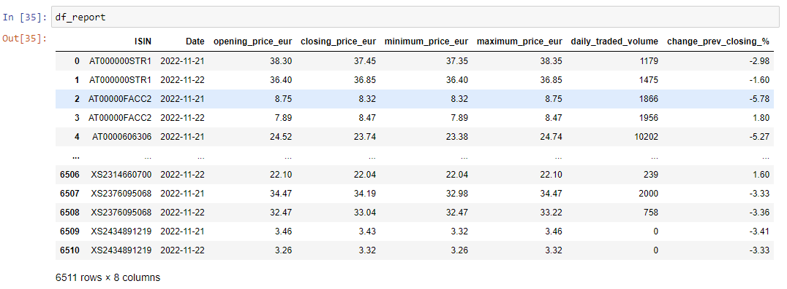
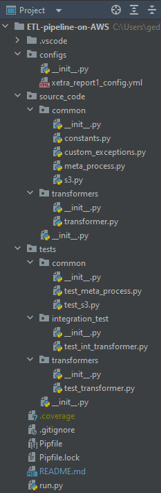
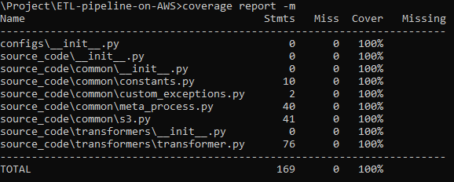

# ETL pipeline on AWS
In this project using Python and Pandas I extracted data from AWS S3 bucket, transformed data and loaded to another AWS S3 bucket. Restructured initial Python code in to functions and classes. Used logging, exception handling, configurations file, meta file for ETL control. Ran unit and integration testing. Achieved 100% test coverage.
### Details
Set up Python Virtual Environment.  
Set up AWS buckets and user.  
Used Jupyter Notebook to write [initial code].  

[initial code]: < https://github.com/Geduifx/ETL-pipeline-on-AWS/tree/develop/Jupyter%20Notebook >

Got list of csv files from AWS S3 bucket, read csv files with Pandas.  

Created report by filtering data by columns and made data transformations (calculate opening, closing, max, min prices, trading volume, percent change, aggregate by instrument and date).  
 

Added argument date to determine the start date of the report.  
Saved report as parquet file to another AWS S3 bucket.  
Restructured the code in to adapter (read_csv_to_df, write_df_to_s3, list_files_in_prefix) and application (extract, transform_report1, load, etl_report1, return_date_list) layer functions, also main function (runs all other functions and has all the arguments).  
Added meta file for filtering on which dates ETL was already performed.   
Added new functions for reading and updating meta file, updated other functions to also to use meta file.  
Set up PyCharm (IDE, Integrated Development Environment).  
Set up Git and Github to use with PyCharm.  
Set up project folder structure.  

Placed init.py empty file in all folders. This allows to import modules.  
Created classes and used functions that were coded on Jupyter Notebook as methods.  
Added logging, exception handling, configurations file, meta file for job control.  
Used clean coding principles and Linting.  
Ran unit and integration testing. Achieved 100% test coverage.  

Locked pipfile.  
Committed and pushed code to Github.  

### Future projects
It would be interesting to expand this project with dependency management in Python, performance tuning with profiling, Dockerization, Kubernetes and Apache Airflow.

### Credits
This project is based on Udemy course [Writing production-ready ETL pipelines in Python / Pandas].

[Writing production-ready ETL pipelines in Python / Pandas]: <https://www.udemy.com/course/writing-production-ready-etl-pipelines-in-python-pandas/>
